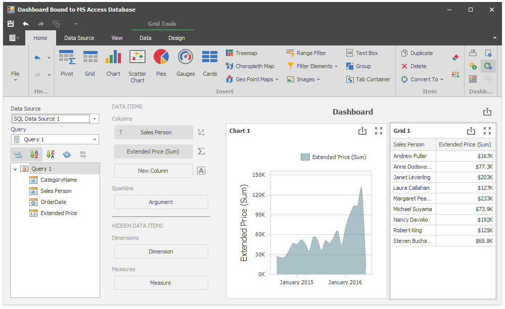

<!-- default badges list -->

<!-- default badges end -->
<!-- default file list -->
*Files to look at*:

* [Form1.cs](./CS/Dashboard_DashboardDataProviders/Form1.cs) (VB: [Form1.vb](./VB/Dashboard_DashboardDataProviders/Form1.vb))
<!-- default file list end -->
# Dashboard for WinForms - How to Bind a Dashboard to an SQL Data Source at runtime

This example shows how to bind a dashboard to a Microsoft Access database (MS SQL Server, XML file). For this, create a [DashboardSqlDataSource](https://docs.devexpress.com/Dashboard/DevExpress.DashboardCommon.DashboardSqlDataSource) instance and specify connection parameters.

## Documentation

* [Connect to SQL Databases](https://docs.devexpress.com/Dashboard/16132)
* [Connecting to a Data Source](https://docs.devexpress.com/Dashboard/116879)
* [Providing Data](https://docs.devexpress.com/Dashboard/12146)
* [Dashboard.ConfigureDataConnection](https://docs.devexpress.com/Dashboard/DevExpress.DashboardCommon.Dashboard.ConfigureDataConnection) event

## More Examples

* [Dashboard for WinForms - How to bind a dashboard to a Microsoft SQL Server database file at runtime](https://github.com/DevExpress-Examples/how-to-bind-dashboard-to-sql-server-database-file)
* [Dashboard for WinForms - How to Replace the Dashboard Sql Data Source with the Dashboard Object Data Source](https://github.com/DevExpress-Examples/how-to-replace-dashboardsqldatasource-with-dashboardobjectdatasource-with-filtered-data-t556647)
* [Dashboard for WPF - How to bind a dashboard to a Microsoft SQL Server database file](https://github.com/DevExpress-Examples/wpf-dashboard-how-to-bind-to-sql-database-file)
